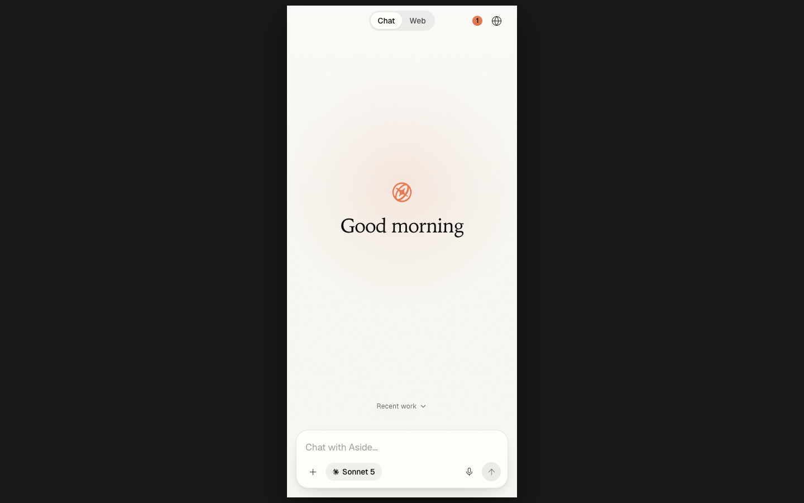
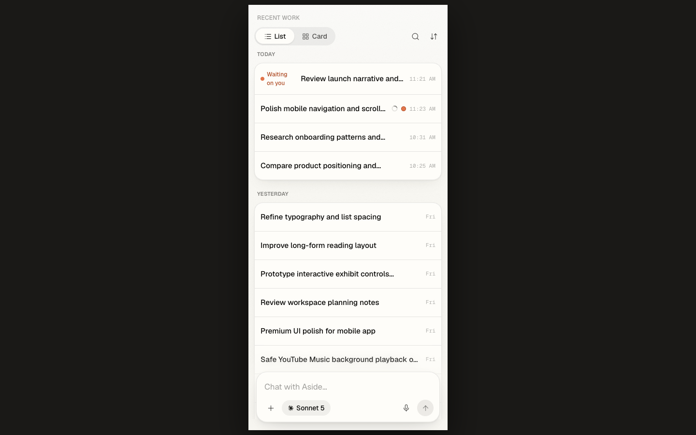

# Aside Mobile

Use your Mac's [Aside](https://aside.so) agent from a phone.

Aside Mobile provides chat, live browser viewing, local browser-history search, voice input, file uploads, and completion notifications through a private Tailscale connection.

Android can run as a native Capacitor app with an embedded GeckoView browser; iPhone and Android can also install the same interface as a home-screen web app.

<p align="center">
  
  
</p>

## Security model

- The app server binds to `127.0.0.1`; Tailscale Serve is the only remote entry point.
- The pairing page uses a separate loopback-only listener on the default pairing port `8791` and must never be proxied.
- Pairing codes are random, single-use, expire after ten minutes, and are never embedded in an APK.
- Session credentials travel in an HttpOnly cookie, an Authorization header, or the WebSocket's first auth frame, never in resource or WebSocket URLs.
- Protected images and downloads are fetched with credentials and rendered or saved through temporary `blob:` URLs.
- Runtime secrets and uploaded files stay outside the repository under per-machine state directories.

See [Security](#security) before exposing the service beyond a personal tailnet.

## Requirements

**Mac**

- macOS with Aside installed and signed in
- Node.js **22.5 or newer**
- Git
- Tailscale, signed in to the same tailnet as the phone

Install Homebrew from its [official instructions](https://brew.sh/) if needed, then install Node:

```bash
brew install node
node --version
```

**Phone**

- Tailscale connected to the same account
- Android 8.0+ or iOS 16.4+

The Android APK additionally needs JDK 21 and Android SDK 36; the web app does not.

## Install

```bash
git clone https://github.com/ThoughtTaken27/aside-mobile.git ~/aside-mobile
cd ~/aside-mobile/miniapp
npm run setup
```

`npm run setup` uses the committed lockfile, builds both workspaces, and runs the installation doctor.

Runtime and Tailscale warnings are expected until the next steps are complete; dependency, build, and configuration failures are not.

## Connect through Tailscale

Install and open Tailscale on the Mac and phone:

```bash
brew install --cask tailscale
open -a Tailscale
```

After signing in, verify the Mac is connected:

```bash
TS=/Applications/Tailscale.app/Contents/MacOS/Tailscale
$TS status
export ASIDE_TAILNET_HOST="$($TS status --json | node -e \
  'const d=JSON.parse(require("fs").readFileSync(0,"utf8")); console.log(d.Self.DNSName.replace(/\.$/,""))')"
printf '\nexport ASIDE_TAILNET_HOST=%q\n' "$ASIDE_TAILNET_HOST" >> ~/.zshrc
```

Enable **HTTPS Certificates** in the [Tailscale DNS settings](https://login.tailscale.com/admin/dns), then proxy only the app port:

```bash
$TS serve --bg 8790
$TS serve status
```

Expected routing:

```text
https://your-mac.your-tailnet.ts.net -> http://127.0.0.1:8790
```

Never proxy the default pairing port `8791`; it issues pairing links to a person physically using the Mac.

## Run the server

```bash
cd ~/aside-mobile/miniapp
npm start
```

Verify both paths:

```bash
curl -s http://127.0.0.1:8790/api/health
curl -sI "https://$ASIDE_TAILNET_HOST/app" | head -1
```

For a persistent launchd service:

```bash
npm run launchd          # install/start
npm run launchd -- off   # stop/remove
```

The installer writes `~/Library/LaunchAgents/com.aside.mobile.plist`, stores logs in `~/Library/Logs/`, and snapshots supported `MINIAPP_*`, `ASIDE_TAILNET_HOST`, and `TAILSCALE_CLI` overrides from the current shell.

Rerun `npm run launchd` after changing those overrides because launchd does not inherit `~/.zshrc` automatically.

## Pair a phone

On the Mac, open:

```bash
open "http://127.0.0.1:${MINIAPP_PAIR_PORT:-8791}/pair"
```

The page creates a fresh code for that load; it expires after ten minutes and works once.

If the page says Tailscale is not ready, start Tailscale or export `ASIDE_TAILNET_HOST`, restart the server, and reload instead of using a localhost link on the phone.

**Android web app**

1. Scan the QR code.
2. In Chrome, choose **Add to Home screen**.

**Android native APK**

1. Build and install the APK first.
2. Open the app.
3. Copy the link from the Mac pairing page and paste it into the app's pairing screen.

**iPhone home-screen app**

1. In Safari, open `https://<your-tailnet-host>/app`.
2. Choose **Share**, **Add to Home Screen**, then **Add**.
3. Open Aside from the home-screen icon.
4. Copy the link from the Mac pairing page and paste it into the app.

Do not pair an iPhone in Safari before installation; Safari tabs and installed web apps use separate storage.

## Build the optional Android app

Install JDK 21 and Android command-line tools:

```bash
brew install --cask temurin@21
brew install --cask android-commandlinetools
export JAVA_HOME="$(/usr/libexec/java_home -v 21)"
export ANDROID_HOME="$HOME/Library/Android/sdk"
export PATH="$ANDROID_HOME/cmdline-tools/latest/bin:/opt/homebrew/share/android-commandlinetools/cmdline-tools/latest/bin:$ANDROID_HOME/platform-tools:$PATH"
sdkmanager "platform-tools" "platforms;android-36" "build-tools;36.0.0"
```

Build:

```bash
cd ~/aside-mobile
./build-android.sh
```

The script verifies that no pairing credential is present, builds an arm64 debug APK, copies it to `~/Downloads/Aside-mobile.apk`, and keeps a local archive under `~/.aside-mobile/apk/`.

It does not publish or serve the APK.

Verify its checksum before transferring it to the phone:

```bash
shasum -a 256 ~/Downloads/Aside-mobile.apk
```

Android may warn about a sideloaded debug APK; do not disable Play Protect. Use the web app instead if the device will not install a locally built package under its normal security policy.

The APK requests microphone and network access only; inspect `miniapp/web/android/app/src/main/AndroidManifest.xml` for the authoritative permission list.

## Verify

```bash
cd ~/aside-mobile/miniapp
npm run doctor
npm run typecheck
npm test
npm run build
npm audit --omit=dev
```

GitHub Actions runs install, typecheck, tests, and builds on Node 22 and 24.

## Project layout

```text
AGENTS.md                 agent-oriented setup procedure
build-android.sh          local Android build and archive
miniapp/
  scripts/                doctor and launchd installer
  server/                 Fastify API and loopback pairing listener
  web/                    React/Vite UI and Capacitor Android project
```

## Configuration

A fresh clone needs no config file and starts in standalone mode.

The server creates its signing secret outside the repository with mode `0600`; `npm run doctor` prints the resolved paths and catches unsafe configuration.

Environment overrides are documented in `miniapp/server/src/config.ts`; common ones include:

- `ASIDE_TAILNET_HOST`: stable MagicDNS hostname override
- `MINIAPP_PORT` / `MINIAPP_PAIR_PORT`: listener ports
- `MINIAPP_ASIDE_CLI`: Aside CLI path
- `MINIAPP_STATE_DIR`: standalone state directory
- `MINIAPP_SESSIONS_DIR`: Aside session directory

Telegram compatibility remains optional and disabled when no bridge config exists.

## Security

This software can access Aside sessions, local browser history, browser tabs, uploaded files, and microphone input on the machine running it.

Review the trust boundary before use:

- `miniapp/server/src/auth.ts`: session cookies and token verification
- `miniapp/server/src/app.ts`: API authorization and response headers
- `miniapp/server/src/pair.ts`: loopback pairing and one-time codes
- `miniapp/server/src/ws.ts`: WebSocket authentication
- `build-android.sh`: every Android build step
- `miniapp/web/android/app/src/main/AndroidManifest.xml`: Android permissions

Useful checks:

```bash
git remote -v
npm audit --omit=dev --prefix miniapp
git grep -nE 'https?://[A-Za-z0-9.-]+' -- 'miniapp/*/src/**'
lsof -nP -iTCP:8790 -sTCP:LISTEN
lsof -nP -iTCP:8791 -sTCP:LISTEN
```

Expected listeners are loopback-only; the default pairing port `8791` must not appear in Tailscale Serve configuration.

To invalidate every paired session after suspected credential exposure:

```bash
rm ~/.aside-mobile/miniapp-secret.json
# restart the server and pair each device again
```

No Anthropic credential belongs in this repository; the server talks to the authenticated Aside daemon already running on the Mac.

## Troubleshooting

| Symptom | Likely cause | Fix |
| --- | --- | --- |
| Pair page says Tailscale is not ready | Tailscale CLI cannot report a MagicDNS name | Start/sign in to Tailscale or set `ASIDE_TAILNET_HOST`, then restart |
| Pairing rejected | Link expired or was already spent | Reload the Mac pairing page and use the new link within ten minutes |
| Phone cannot reach the Mac | Mac asleep, server stopped, or Tailscale disconnected | Wake the Mac, start the server, and check `tailscale serve status` |
| iPhone asks to pair again | Pairing happened in Safari, not the installed app | Open the home-screen app and paste a new link there |
| History/search are empty | Node is older than 22.5 | Upgrade Node, rebuild, and restart |
| Android SDK target missing | SDK 36 packages are absent | Run the `sdkmanager` command above |
| Gradle is killed | Insufficient memory | Close other apps; keep the build script's single-worker flags |

## License

MIT. See [LICENSE](LICENSE).

The project retains attribution to its original open-source bridge foundation in the license history.
